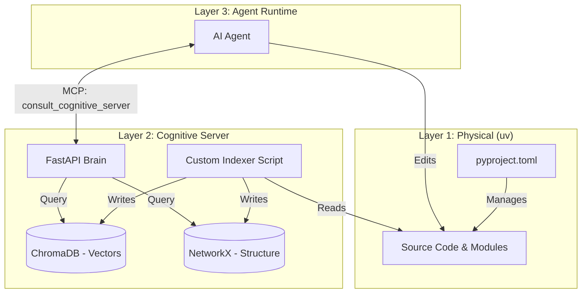

# ADHD Framework: The Unified Vision (v3)
*The Protocol for Agent Intelligence · December 2025*

---

## 1. Executive Summary
The ADHD Framework is evolving from a collection of Python scripts into a **Cognitive Protocol for AI Agents**.
Our mission is to solve **"Context Drift"**—the phenomenon where AI agents lose track of architectural rules and available tools as a project grows.

We are pivoting from a custom, fragile package manager to a robust, standard foundation (`uv`) augmented by a sophisticated **Cognitive Server** (Hybrid RAG). This report outlines the complete vision for the next generation of the framework.

---

## 2. Historical Context & The Pivot

### The Origin: "Sharding"
The framework began as a solution to spaghetti code. We introduced **Sharding**: breaking code into strict modules (Managers, Cores, Utils) and attaching a "Semantic Sidecar" (`.instructions.md`) to every module. This allowed agents to understand code in isolated chunks.

### The Mistake: "Accidental Reinvention"
To manage these modules, we built a custom bootstrapper (`adhd_framework.py` + `init.yaml`). This was a mistake. It forced us to maintain a fragile package manager instead of focusing on AI intelligence.

### The Decision
We are **killing the custom bootstrapper**.
We are moving to **`uv`** (a high-performance Python package manager) and `pyproject.toml`. This shifts the burden of file management to standard tools, freeing us to build the "Brain" of the framework.

---

## 3. The Core Philosophy
**We are not building a Python package manager.**
**We are building a Protocol for AI-Codebase Interaction.**

Most frameworks optimize for *Human* readability.
**ADHD optimizes for *Agent* reasoning.**

*   **Filesystem as Prompt**: The folder structure and `.instructions.md` files are not just documentation; they are "Prompt Engineering baked into the filesystem."
*   **Agent-First**: Every architectural decision is measured by one metric: *Does this help the agent understand the system better?*

---

## 4. Layer 1: The Physical Foundation (`uv`)
The new physical layer relies on industry standards to ensure speed and compatibility.

*   **Mechanism**: A root `pyproject.toml` defines the workspace.
*   **Modules**: Every Manager, Core, and Util is a **Local Path Dependency**.
*   **Benefit**: "Editable Installs" come for free. If an agent modifies `utils/logger`, the change is instantly reflected across the system without copying files.

---

## 5. Layer 2: The Cognitive Substrate (The Brain)
This is the core innovation of v3. We are replacing static file scanning with a live **Cognitive Server**.

### The Problem: The "Context Wall"
As the framework grows to 100+ modules, we cannot feed all 100 `.instructions.md` files into an agent's context window. The agent becomes "blind" to tools it doesn't know exist (e.g., failing to find `questionary_core` because it searched for "input").

### The Solution: Hybrid RAG (Graph + Vector)
We propose a dual-engine architecture that combines **Semantic Search** with **Structural Awareness**.

| Component | Role | Analogy | Function |
| :--- | :--- | :--- | :--- |
| **Vector Store** | **The Librarian** | "Fuzzy Search" | Understands intent. "Find me a tool for user input" -> Returns `questionary_core`. |
| **System Graph** | **The Map** | "Rigid Structure" | Understands reality. "If you use `questionary_core`, you MUST import `exceptions_core`." |

### The Workflow
1.  **The Laser (RAG)**: The agent asks a vague question. The Vector Store finds the best *entry point* module based on semantic similarity.
2.  **The Structure (Graph)**: The System Graph analyzes the entry point and pulls in all required dependencies (config, utils, exceptions) to ensure the agent has a *complete* working context.
3.  **Synthesis**: The server hands the agent a "Context Pack" containing exactly the files it needs—no more, no less.

### Active Context (The Push Model)
The server doesn't just wait for questions. It watches the agent.
*   *Trigger*: Agent opens `managers/auth_manager.py`.
*   *Action*: Server pushes `auth_manager.instructions.md` and `security_policy.md` into the system prompt automatically.

---

## 6. Implementation Strategy

### Build vs. Buy: "Buy the Engine, Build the Car"
We will use standard libraries for complex math and networking, but write custom logic to handle our unique architecture.

*   **The Stack**:
    *   **Database**: `ChromaDB` (Local Vector Store).
    *   **Embeddings**: `sentence-transformers` (Local, free, fast).
    *   **Server**: `FastAPI` (Python).
    *   **Graph**: `NetworkX` (In-memory dependency graph).

### The 3-Phase Plan
1.  **Phase 1: The Indexer (The Writer)**
    *   A custom script that crawls `cores/`, `managers/`, and `utils/`.
    *   It parses `.instructions.md` files, extracting "Dependencies" for the Graph and "Usage" text for the Vector Store.
2.  **Phase 2: The Server (The Reader)**
    *   A local API that accepts natural language queries.
    *   It performs the "Vector Search -> Graph Expansion" logic.
3.  **Phase 3: The Interface (MCP)**
    *   We expose the server to the agent via a single **Model Context Protocol (MCP)** tool: `consult_cognitive_server(query)`.

---

## 7. Roadmap & Strategy

### Phase 1: The "Test Flight" (Current Status)
**Objective**: Freeze core development. Build real apps with the *current* (flawed) v1 framework.
*   **Why**: We need data. Where does the agent fail? What context is missing?
*   **Action**: Record "Friction Logs" and "Hallucination Reports".

### Phase 2: The Foundation (`uv` Migration)
**Objective**: Replace the physical layer.
*   **Action**: Kill `init.yaml` and `adhd_framework.py`.
*   **Implementation**: Migrate to `uv` workspaces and `pyproject.toml`. Ensure all modules are local path dependencies.

### Phase 3: The Structure (System Graph)
**Objective**: Map the territory.
*   **Action**: Build the "Graph Scanner" hook.
*   **Implementation**: Generate `.adhd/graph.json` from `pyproject.toml` and imports. This gives us the "Map" (deterministic dependencies).

### Phase 4: The Brain (Cognitive Server / RAG)
**Objective**: Enable semantic discovery.
*   **Action**: Build the Vector Store and RAG Server.
*   **Implementation**: Index `.instructions.md` files into ChromaDB. Connect the "Laser" (RAG) to the "Map" (Graph) via the Cognitive Server API.

---

## 8. Architecture Diagram

